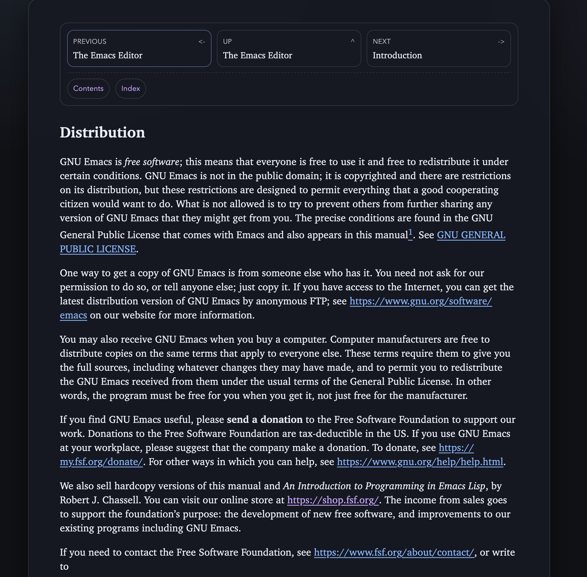
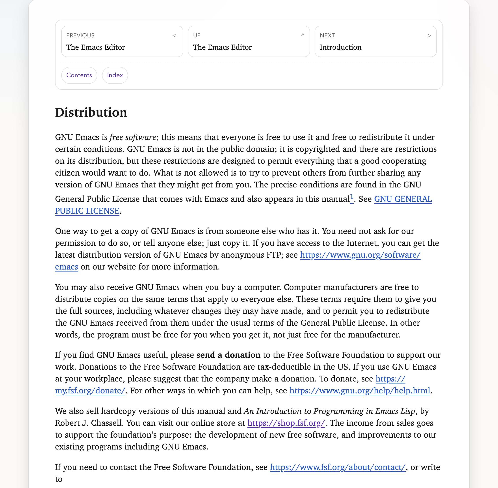

# Community Userscripts Gallery

This repo is a small community space for sharing browser userscripts (Violentmonkey/Tampermonkey) that improve the UX of specific websites.

Right now the "gallery" is this README to keep the concept lightweight. If the idea takes off, we can move to a proper GitHub Pages site (Jekyll) for a nicer browsing experience.

## Install (Violentmonkey)

1) Install Violentmonkey
   - Desktop: https://violentmonkey.github.io/
   - Mobile: Firefox for Android supports extensions; install Violentmonkey there.
2) Open a script file in this repo and install it.
   - Tip: if you host this repo on GitHub, use the `raw` file view so Violentmonkey recognizes it.

## Gallery
| Preview (Dark) | Preview (Light) | Userscript (install) | Author / Updated | Tags |
| --- | --- | --- | --- | --- |
|  |  | [Reading Card + Theme Toggle (Emacs Manual)](scripts/emacs-manual-themer/script.user.js?raw=1) | Andrea Alberti (March 2026) | `desktop` `mobile` `dark` `light` `auto` `navigation` |

## Contributing

PRs are welcome. Each new userscript should be added under `scripts/<slug>/` with at least one representative screenshot.

Please include a contribution date in the script metadata so readers have a sense of how recent the script is.

The gallery links to the userscript file with `?raw=1` so Violentmonkey can install it directly.

See `CONTRIBUTING.md`.
